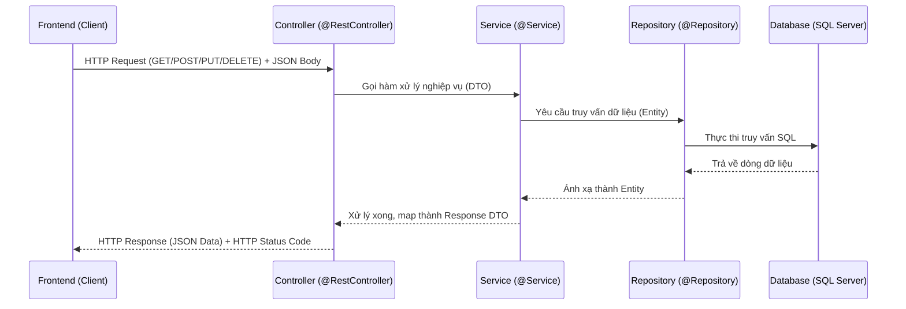

# Phân tích Kiến trúc: MVC vs REST API trong Autowash Backend

## 1. Kết Luận Nhanh (Executive Summary)
Dự án backend **Autowash** hiện tại được xây dựng hoàn toàn theo mô hình **REST API** (hoặc Restful API) kết hợp với kiến trúc phân tầng (Layered Architecture), chứ không phải mô hình **MVC (Model-View-Controller)** truyền thống (Server-side rendering).

### So sánh nhanh trạng thái hiện tại:
- **Không sử dụng MVC truyền thống:** Backend không trực tiếp trả về các giao diện người dùng (giao diện HTML, JSP, Thymeleaf,...).
- **Sử dụng REST API:** Backend đóng vai trò là một nhà cung cấp dữ liệu (Data Provider), nhận dữ liệu JSON đầu vào, xử lý nghiệp vụ và trả về kết quả dưới dạng JSON (thông qua các `@RestController` và DTO).
- **Phân tách Frontend và Backend độc lập:** Giao diện (Frontend) được phát triển riêng biệt (sử dụng React, Vue hoặc Angular) và giao tiếp với Backend thông qua các HTTP Request.

---

## 2. Giải Thích Chi Tiết Sự Khác Biệt (MVC vs REST API)
Hãy cùng so sánh cơ chế hoạt động của MVC truyền thống và REST API trong Spring Boot để hiểu rõ lý do tại sao dự án của bạn thuộc nhóm REST API:

### A. Mô hình MVC truyền thống (Model - View - Controller)
Trong mô hình MVC cổ điển (chạy hoàn toàn trên Server):
1. **Model (M):** Đại diện cho dữ liệu và logic kết nối cơ sở dữ liệu (Entity, Repository).
2. **View (V):** Giao diện hiển thị (HTML, CSS, JS, các template engine như Thymeleaf, JSP, Freemarker).
3. **Controller (C):** Nhận request từ trình duyệt, lấy dữ liệu từ Model, nạp dữ liệu đó vào View (ví dụ gán biến vào Model map) rồi trả về tên file giao diện để server kết xuất (render) thành mã HTML gửi về trình duyệt của khách hàng.

*Annotation điển hình ở Spring Boot:* `@Controller` (không đi kèm `@ResponseBody` hoặc trả về Template/HTML trực tiếp).

### B. Mô hình REST API (Kiến trúc hiện tại của Autowash)
Trong dự án Autowash:
1. **Giao diện (View) nằm hoàn toàn ở Frontend:** Trình duyệt tải ứng dụng Frontend (React/Vue/HTML tĩnh) về máy client và chạy độc lập. Giao diện được vẽ trực tiếp trên trình duyệt.
2. **Backend chỉ quản lý dữ liệu (Model + Controller):**
   - **Controller:** Sử dụng `@RestController` (là sự kết hợp của `@Controller` và `@ResponseBody`), tự động chuyển đổi đối tượng Java (DTO/Entity) thành định dạng dữ liệu **JSON** để trả về cho Frontend.
   - **Service & Repository:** Xử lý nghiệp vụ và truy vấn cơ sở dữ liệu.

*Luồng giao tiếp:*


---

## 3. Cấu Trúc File & Package Thực Tế
Hãy xem cấu trúc thư mục của dự án Autowash để thấy rõ sự phân bổ các tầng REST API:

### A. Cách tổ chức thư mục theo Feature-based
Hiện tại dự án đang được tổ chức theo từng nhóm tính năng (`features`), mỗi feature chứa đầy đủ các tầng riêng biệt:
- [com.autowash.features.booking](file:///src/main/java/com/autowash/features/booking)
- [com.autowash.features.wallet](file:///src/main/java/com/autowash/features/wallet)
- [com.autowash.features.car](file:///src/main/java/com/autowash/features/car)

Trong mỗi feature, cấu trúc phân tầng được duy trì nghiêm ngặt:
1. **Controller Layer (REST Controller):**
   - Ví dụ: [AdminController.java](file:///src/main/java/com/autowash/features/analytics/controller/AdminController.java) hoặc [CustomerBookingController.java](file:///src/main/java/com/autowash/features/booking/controller/CustomerBookingController.java)
   - Sử dụng `@RestController` và các `@GetMapping`, `@PostMapping` để định nghĩa endpoint API.
   - Trả dữ liệu kiểu JSON thông qua DTO chứ không trả file HTML.
2. **Service Layer (Nghiệp vụ):**
   - Ví dụ: `BookingService.java` hoặc `WashService.java`
   - Nhận yêu cầu từ Controller, áp dụng quy tắc nghiệp vụ và gọi Repository.
3. **Repository Layer (Truy cập dữ liệu):**
   - Ví dụ: `BookingRepository.java`
   - Kế thừa `JpaRepository` để giao tiếp với DB SQL Server thông qua Spring Data JPA.
4. **Entity Layer (Mô hình dữ liệu):**
   - Ví dụ: [Wallet.java](file:///src/main/java/com/autowash/features/wallet/entity/Wallet.java)
   - Biểu diễn cấu trúc bảng dữ liệu trong DB.
5. **DTO (Data Transfer Object) Layer:**
   - Ví dụ: `BookingDataResponse.java` hoặc `AvailableServiceResponse.java`
   - Dùng để đóng gói dữ liệu phản hồi API hoặc nhận dữ liệu đầu vào (Request DTO) từ FE, bảo mật thông tin và tối ưu hóa dữ liệu truyền tải qua mạng.

---

## 4. Tại Sao REST API Lại Được Ưu Tiên Hơn MVC Trong Dự Án Này?
1. **Trải nghiệm người dùng tốt hơn (Single Page Application - SPA):**
   - Frontend có thể cập nhật giao diện mượt mà không cần tải lại toàn bộ trang web mỗi khi bấm nút.
2. **Độc lập và dễ phát triển song song:**
   - Team Frontend và Team Backend có thể làm việc độc lập. Chỉ cần thống nhất định dạng API (Swagger/Postman/DTO) là có thể code song song.
3. **Đa nền tảng (Cross-platform):**
   - Một Backend REST API có thể phục vụ đồng thời cho cả ứng dụng Web (React/Vue), ứng dụng Mobile (iOS/Android), hay các dịch vụ tích hợp của bên thứ ba mà không cần viết lại logic nghiệp vụ.

---

## 5. Hướng Dẫn Frontend Giao Tiếp Với REST API Này
Để lấy dữ liệu từ Backend, Frontend sử dụng các thư viện như `axios` hoặc API `fetch` mặc định của Javascript:

### Ví dụ luồng lấy Số dư ví (Wallet Balance):
**API Endpoint từ Backend:**
- **URL:** `GET /api/customer/wallet/balance` (Giả định)
- **Response mẫu:**
```json
{
  "balance": 150000.0,
  "lastUpdated": "2026-06-24T21:00:00"
}
```

**Frontend Call (React/Vue/JS):**
```javascript
import axios from 'axios';

// Lấy token từ localStorage/cookies để gửi kèm trong header
const token = localStorage.getItem('token');

axios.get('http://localhost:8080/api/customer/wallet/balance', {
    headers: {
        'Authorization': `Bearer ${token}`
    }
})
.then(response => {
    console.log("Số dư ví của khách hàng là:", response.data.balance);
    // Cập nhật lên UI Frontend
})
.catch(error => {
    console.error("Lỗi khi lấy số dư ví:", error);
});
```
